# StyleGAN3-Based Intelligent Footwear Design System for Automated Creative Generation

A Final Year Project (FYP) that adapts NVIDIA's StyleGAN3 architecture for intelligent footwear design. The system is trained on a custom shoe dataset and exposed through a full-stack web application, enabling users to generate novel shoe designs from either an uploaded image or a text description.

> **Based on:** [Alias-Free Generative Adversarial Networks (StyleGAN3)](https://nvlabs.github.io/stylegan3) — Karras et al., NeurIPS 2021. The original codebase targeted human face generation (FFHQ dataset). This project re-trains the model on footwear images and wraps it in a web application with text-to-image capabilities via CLIP.

---

## Table of Contents

- [Project Overview](#project-overview)
- [Key Features](#key-features)
- [System Architecture](#system-architecture)
- [Project Structure](#project-structure)
- [Requirements](#requirements)
- [Installation](#installation)
- [Configuration](#configuration)
- [Running the Web Application](#running-the-web-application)
- [Training Your Own Model](#training-your-own-model)
- [Preparing a Shoe Dataset](#preparing-a-shoe-dataset)
- [Standalone Generation Scripts](#standalone-generation-scripts)
- [Quality Metrics](#quality-metrics)
- [Spectral Analysis](#spectral-analysis)
- [Interactive Visualizer](#interactive-visualizer)
- [Acknowledgements](#acknowledgements)
- [License](#license)

---

## Project Overview

This system fine-tunes the StyleGAN3-T generator on a custom dataset of shoe images. The trained generator is integrated into a Flask web application that offers two generation modes:

1. **Image-to-Variations** : Upload a shoe photo; the system projects it into the StyleGAN3 latent space using LPIPS-guided optimisation and generates multiple stylistic variations.
2. **Text-to-Image** : Enter a text prompt (e.g., *"blue sneaker with white sole"*); the system uses [OpenAI CLIP](https://github.com/openai/CLIP) to optimise a latent code in W-space until the generated image best matches the description.

User accounts, generated designs, and favourites are persisted using Firebase Authentication + Firestore, and images are stored in Cloudinary.

---

## Sample Outputs

### Image-to-Variation Generation

Upload any shoe image. The system projects it into StyleGAN3's Z-space using LPIPS + MSE optimisation, reconstructs the shoe, then generates four stylistic variations at increasing latent perturbation strengths (0.1 → 0.5). The samples below span a range of shoe styles — trainers, flat shoes, runners, and formal footwear.

| | Input | Reconstruction | Variation (0.1) | Variation (0.2) | Variation (0.3) | Variation (0.5) |
|---|:---:|:---:|:---:|:---:|:---:|:---:|
| **Sample 1** |  |  |  |  |  |  |
| **Sample 2** |  |  |  |  |  |  |
| **Sample 3** |  |  |  |  |  |  |
| **Sample 4** |  |  |  |  |  |  |
| **Sample 5** |  |  |  |  |  |  |
| **Sample 6** |  |  |  |  |  |  |
| **Sample 7** | 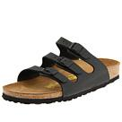 | 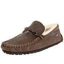 | 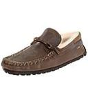 | 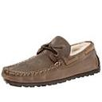 | 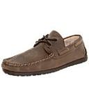 | 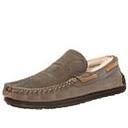 |
| **Sample 8** | 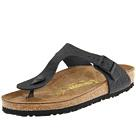 | 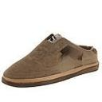 | 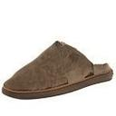 | 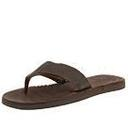 | 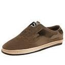 | 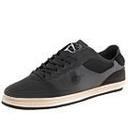 |
| **Sample 9** | 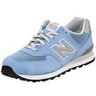 | 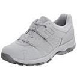 | 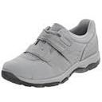 | 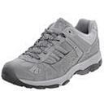 | 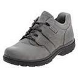 | 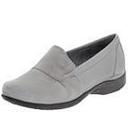 |
| **Sample 10** | 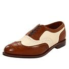 |  | 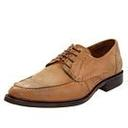 | 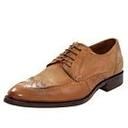 | 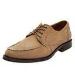 | 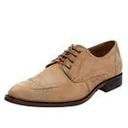 |
| **Sample 11** | 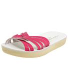 | 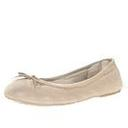 | 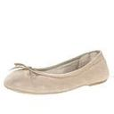 | 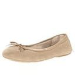 | 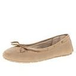 | 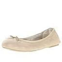 |
| **Sample 12** |  | 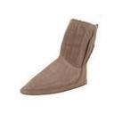 | 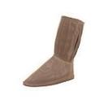 | 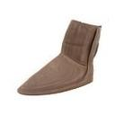 | 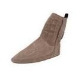 | 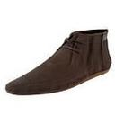 |
| **Sample 13** | 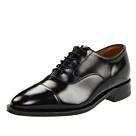 | 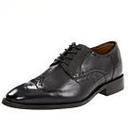 |  | 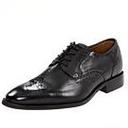 | 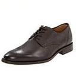 | 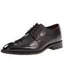 |
| **Sample 14** | 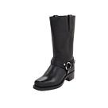 | 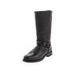 | 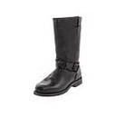 | 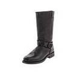 | 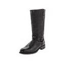 | 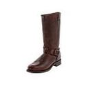 |
| **Sample 15** | 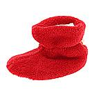 | 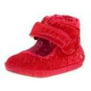 |  | 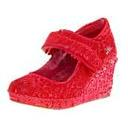 |  |  |
| **Sample 16** | 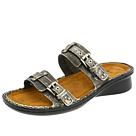 | 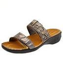 |  |  |  |  |
| **Sample 17** |  |  |  |  |  |  |
| **Sample 18** |  |  |  |  |  |  |
| **Sample 19** |  |  |  |  |  |  |
| **Sample 20** |  |  |  |  |  |  |
| **Sample 21** |  |  |  |  |  |  |
| **Sample 22** |  |  |  |  |  |  |
| **Sample 23** |  |  |  |  |  |  |
| **Sample 24** |  |  |  |  |  |  |
| **Sample 25** |  |  |  |  |  |  |
| **Sample 26** |  |  |  |  |  |  |
| **Sample 27** |  |  |  |  |  |  |
| **Sample 28** |  |  |  |  |  |  |
| **Sample 29** |  |  |  |  |  |  |

---

### Text-to-Image Generation

The following shoes were generated **purely from text prompts** — no input image was used. The system optimises a latent code in StyleGAN3's W-space using CLIP (ViT-B/32) until the generated image best matches the description.

<table>
  <tr>
    <td align="center">
      <br/>
      <sub><i>"blue sneaker with white sole"</i></sub>
    </td>
    <td align="center">
      <br/>
      <sub><i>"red high heels"</i></sub>
    </td>
    <td align="center">
      <br/>
      <sub><i>"orange sneaker"</i></sub>
    </td>
    <td align="center">
      <br/>
      <sub><i>"brown chappals"</i></sub>
    </td>
    <td align="center">
      <br/>
      <sub><i>"yellow formal shoes for men"</i></sub>
    </td>
  </tr>
  <tr>
    <td align="center">
      <br/>
      <sub><i>"red leather high top sneakers"</i></sub>
    </td>
    <td align="center">
      <br/>
      <sub><i>"formal shoe"</i></sub>
    </td>
    <td align="center">
      <br/>
      <sub><i>"orange joggers with stripes"</i></sub>
    </td>
    <td align="center">
      <br/>
      <sub><i>"sports shoe"</i></sub>
    </td>
    <td align="center">
      <br/>
      <sub><i>"sports shoe for women"</i></sub>
    </td>
  </tr>
</table>

---

## Key Features

- **StyleGAN3-T** generator trained on a custom shoe dataset (128×128 resolution, 7132 kimgs).
- **Image-to-image generation**: latent-space projection with LPIPS perceptual loss to find the closest latent for an uploaded shoe, then generates variations at configurable perturbation strengths.
- **Text-to-image generation**: CLIP-guided latent optimisation (CLIP ViT-B/32) with multi-candidate initialisation and quality-threshold filtering.
- **Flask web app** with user authentication (Firebase), design history, and favourites.
- **Cloudinary** integration for persistent cloud image storage.
- **Email OTP verification** via Flask-Mail / Gmail SMTP.
- **Interactive GAN visualiser** (`visualizer.py`) for exploring the trained model.
- **Spectral analysis tools** (`avg_spectra.py`) to inspect generator frequency properties.
- **Standalone scripts** for batch image generation and video interpolation.

---

## System Architecture

```
User Browser
    │
    ▼
Flask Web App (app.py)
    ├── Auth routes  ─────────────────────► Firebase Auth (Pyrebase)
    ├── Image-to-Variations route
    │       └── generate_variations()
    │               ├── StyleGAN3 Generator (.pkl)
    │               └── LPIPS projection (Z-space optimisation)
    ├── Text-to-Image route
    │       └── generate_text_to_image()
    │               ├── StyleGAN3 Generator (.pkl)
    │               └── CLIP ViT-B/32 (W-space optimisation)
    └── Favourites / History routes ──────► Firestore + Cloudinary
```

---

## Project Structure

```
.
├── app.py                      # Main Flask application
├── clip_stylegan3_shoes.py     # Standalone CLIP-guided generation class
├── generate_similar_shoe.py    # Standalone image-to-latent projection script
├── GENERATE_from_image.py      # e4e encoder-based generation (experimental)
├── gen_images.py               # Batch image generation from seeds
├── gen_video.py                # Latent interpolation video generation
├── avg_spectra.py              # Spectral analysis tools
├── calc_metrics.py             # FID / KID / precision-recall / equivariance metrics
├── train.py                    # StyleGAN3 training entry point
├── dataset_tool.py             # Dataset preparation (folder → ZIP archive)
├── visualizer.py               # Interactive GUI model visualiser
├── firebase.py                 # Standalone Firebase auth CLI helper
├── legacy.py                   # Pickle compatibility for older model formats
├── environment.yml             # Conda environment specification
├── Dockerfile                  # Docker image definition
├── dnnlib/                     # NVIDIA dnnlib utilities
├── torch_utils/                # Custom PyTorch CUDA extensions
├── training/                   # Training loop, networks, augmentation, losses
├── metrics/                    # Evaluation metric implementations
├── templates/                  # Jinja2 HTML templates (Flask)
│   ├── index.html              # Landing / login-gated main page
│   ├── dashboard.html          # AI Shoe Designer Dashboard
│   ├── loginsignup.html        # Login & sign-up page
│   ├── verify.html             # OTP email verification page
│   └── forgot.html             # Password reset page
├── static/                     # CSS / JS assets
├── outputs/                    # Image-to-variation output directory
└── text_to_image_outputs/      # Text-to-image output directory
```

---

## Requirements

- **OS**: Windows or Linux (Linux recommended for performance).
- **GPU**: NVIDIA GPU with ≥ 8 GB VRAM (tested on a single GPU setup).
- **Python**: 3.8 (64-bit).
- **PyTorch**: 1.9.1 with CUDA 11.1.
- **CUDA toolkit**: 11.1 or later.
- **Compiler**: GCC 7+ (Linux) or Visual Studio 2019+ (Windows) — required for custom CUDA extensions.

Additional Python packages (beyond `environment.yml`):

| Package | Purpose |
|---|---|
| `flask`, `flask-mail` | Web application framework |
| `pyrebase4` | Firebase Authentication client |
| `firebase-admin` | Firestore server-side SDK |
| `cloudinary` | Cloud image storage |
| `lpips` | Perceptual similarity loss for latent projection |
| `clip` (OpenAI) | Text-to-image CLIP guidance |
| `einops` | Tensor rearrangement for CLIP cutouts |

---

## Installation

### 1. Clone the repository

```bash
git clone https://github.com/<your-username>/StyleGAN3-Based-Intelligent-Footwear-Design-System-for-Automated-Creative-Generation.git
cd StyleGAN3-Based-Intelligent-Footwear-Design-System-for-Automated-Creative-Generation
```

### 2. Create the Conda environment

```bash
conda env create -f environment.yml
conda activate stylegan3
```

### 3. Install additional dependencies

```bash
pip install flask flask-mail pyrebase4 firebase-admin cloudinary lpips einops
```

### 4. Install CLIP

```bash
pip install git+https://github.com/openai/CLIP.git
```

> **Windows users**: Ensure the Visual Studio Build Tools are on your `PATH` before running the app, as PyTorch custom extensions are compiled on first launch:
> ```
> "C:\Program Files (x86)\Microsoft Visual Studio\<VERSION>\Community\VC\Auxiliary\Build\vcvars64.bat"
> ```

---

## Configuration

The application requires two JSON configuration files in the project root:

### `config.json` — Flask-Mail credentials

```json
{
  "params": {
    "gmail-user": "your-email@gmail.com",
    "gmail-password": "your-app-password"
  }
}
```

### `cloud_config.json` — Cloudinary + Firebase Admin credentials

```json
{
  "cloudinary": {
    "cloud_name": "your-cloud-name",
    "api_key": "your-api-key",
    "api_secret": "your-api-secret"
  },
  "firebase_admin": "path/to/your-firebase-service-account.json"
}
```

> **Important**: Add both files and your Firebase service account JSON to `.gitignore` before pushing. Never commit credentials to a public repository.

### Model path

Update the `NETWORK_PKL` constant in `app.py` to point to your trained `.pkl` file:

```python
NETWORK_PKL = "path/to/your/network-snapshot-XXXXXX.pkl"
```

---

## Running the Web Application

```bash
conda activate stylegan3
python app.py
```

The app will be available at `http://127.0.0.1:5000`. On first request that triggers generation, the StyleGAN3 model and CLIP model are loaded into GPU memory (this may take ~30 seconds).

**Available pages:**

| URL | Description |
|---|---|
| `/` | Landing page / sign-in redirect |
| `/loginsignup` | Login and registration |
| `/verify` | OTP email verification |
| `/dashboard` | Main AI Shoe Designer interface |
| `/logout` | Sign out |

---

## Training Your Own Model

### 1. Prepare your shoe dataset

Organise shoe images in a folder, then convert to a ZIP archive:

```bash
# From a folder of shoe images
python dataset_tool.py --source=/path/to/shoe_images --dest=~/datasets/shoes-128x128.zip \
    --resolution=128x128
```

### 2. Run training

```bash
# StyleGAN3-T on a single GPU (the configuration used in this project)
python train.py --outdir=~/training-runs \
    --cfg=stylegan3-t \
    --data=~/datasets/shoes-128x128.zip \
    --gpus=1 --batch=32 --gamma=0.5 --mirror=1

# Resume from a checkpoint
python train.py --outdir=~/training-runs \
    --cfg=stylegan3-t \
    --data=~/datasets/shoes-128x128.zip \
    --gpus=1 --batch=32 --gamma=0.5 --mirror=1 \
    --resume=~/training-runs/00013-stylegan3-t-shoedataset-128x128-gpus1-batch32-gamma0.5/network-snapshot-XXXXXX.pkl
```

The training loop saves network pickles (`network-snapshot-<KIMG>.pkl`) and sample grids (`fakes<KIMG>.png`) at regular intervals. FID is evaluated automatically. See [`python train.py --help`](./docs/train-help.txt) and [Training configurations](./docs/configs.md) for the full option reference.

---

## Preparing a Shoe Dataset

Custom datasets are stored as uncompressed ZIP archives containing PNG files and an optional `dataset.json` for labels:

```bash
# Basic conversion from image folder
python dataset_tool.py --source=/path/to/images --dest=~/datasets/shoes-128x128.zip

# Specify output resolution
python dataset_tool.py --source=/path/to/images --dest=~/datasets/shoes-256x256.zip \
    --resolution=256x256
```

See [`python dataset_tool.py --help`](./docs/dataset-tool-help.txt) for all options.

---

## Standalone Generation Scripts

### Generate images from random seeds

```bash
python gen_images.py --outdir=out --trunc=0.7 --seeds=0-15 \
    --network=path/to/network-snapshot.pkl
```

### Generate a latent interpolation video

```bash
python gen_video.py --output=shoe_lerp.mp4 --trunc=0.7 --seeds=0-31 --grid=4x2 \
    --network=path/to/network-snapshot.pkl
```

### CLIP-guided text-to-image (standalone)

```bash
python clip_stylegan3_shoes.py \
    --model_path=path/to/network-snapshot.pkl \
    --prompt="red high heels with pointed toe" \
    --steps=500 \
    --outdir=text_to_image_outputs
```

### Image-to-latent projection and variation (standalone)

```bash
python generate_similar_shoe.py
# Edit the script to set network_pkl and input image path before running.
```

---

## Quality Metrics

FID is computed automatically during training. Additional metrics can be run on any saved checkpoint:

```bash
# FID against the full dataset
python calc_metrics.py --metrics=fid50k_full \
    --data=~/datasets/shoes-128x128.zip \
    --network=path/to/network-snapshot.pkl

# Equivariance metrics
python calc_metrics.py --metrics=eqt50k_int,eqr50k \
    --network=path/to/network-snapshot.pkl

# Kernel inception distance
python calc_metrics.py --metrics=kid50k_full \
    --data=~/datasets/shoes-128x128.zip \
    --network=path/to/network-snapshot.pkl
```

**Recommended metrics:**

| Metric | Description |
|---|---|
| `fid50k_full` | Fréchet Inception Distance (lower is better) |
| `kid50k_full` | Kernel Inception Distance |
| `pr50k3_full` | Precision and Recall |
| `ppl2_wend` | Perceptual Path Length in W-space |
| `eqt50k_int` | Equivariance w.r.t. integer translation |
| `eqr50k` | Equivariance w.r.t. rotation |

---

## Spectral Analysis

Inspect the frequency properties of the generator vs. the training data:

```bash
# Compute dataset statistics
python avg_spectra.py stats --source=~/datasets/shoes-128x128.zip

# Compute spectrum for training data
python avg_spectra.py calc --source=~/datasets/shoes-128x128.zip \
    --dest=tmp/training-data.npz --mean=<mean> --std=<std>

# Compute spectrum for the trained generator
python avg_spectra.py calc \
    --source=path/to/network-snapshot.pkl \
    --dest=tmp/stylegan3-shoes.npz --mean=<mean> --std=<std> --num=70000

# Visualise
python avg_spectra.py heatmap tmp/training-data.npz
python avg_spectra.py heatmap tmp/stylegan3-shoes.npz
python avg_spectra.py slices tmp/training-data.npz tmp/stylegan3-shoes.npz
```

---

## Interactive Visualiser

Explore the trained model interactively — browse the latent space, inspect individual layers, and examine equivariance properties:

```bash
python visualizer.py
```

Load your trained `.pkl` file using the **Pickle** field in the GUI.

---

## Using the Generator from Python

```python
import pickle, torch

with open('path/to/network-snapshot.pkl', 'rb') as f:
    G = pickle.load(f)['G_ema'].cuda()

z = torch.randn([1, G.z_dim]).cuda()   # random latent
c = None                                # no class conditioning
img = G(z, c, truncation_psi=0.7)      # NCHW, float32, range [-1, +1]
```

---

## Acknowledgements

- **Project Authors** — The core contributions of this project, including the shoe-specific training pipeline, the LPIPS-guided latent projection for image-to-image generation, the CLIP-guided text-to-image optimisation loop, the full-stack Flask web application, Firebase/Cloudinary integration, and email OTP authentication, were researched, designed, and implemented from scratch as part of this Final Year Project.
- **NVIDIA Research** for the original [StyleGAN3](https://github.com/NVlabs/stylegan3) codebase (Karras et al., NeurIPS 2021).
- **OpenAI** for [CLIP](https://github.com/openai/CLIP), which powers the text-to-image generation pipeline.
- **Richard Vencu** and the community for CLIP + GAN latent optimisation techniques.

---

## License

The StyleGAN3 base code is made available under the [NVIDIA Source Code License](./LICENSE.txt).  
Copyright © 2021, NVIDIA Corporation & affiliates. All rights reserved.

Modifications made in this project (web application, CLIP integration, shoe-specific training pipeline) are the work of the project authors and are subject to the same license terms as the base code.
